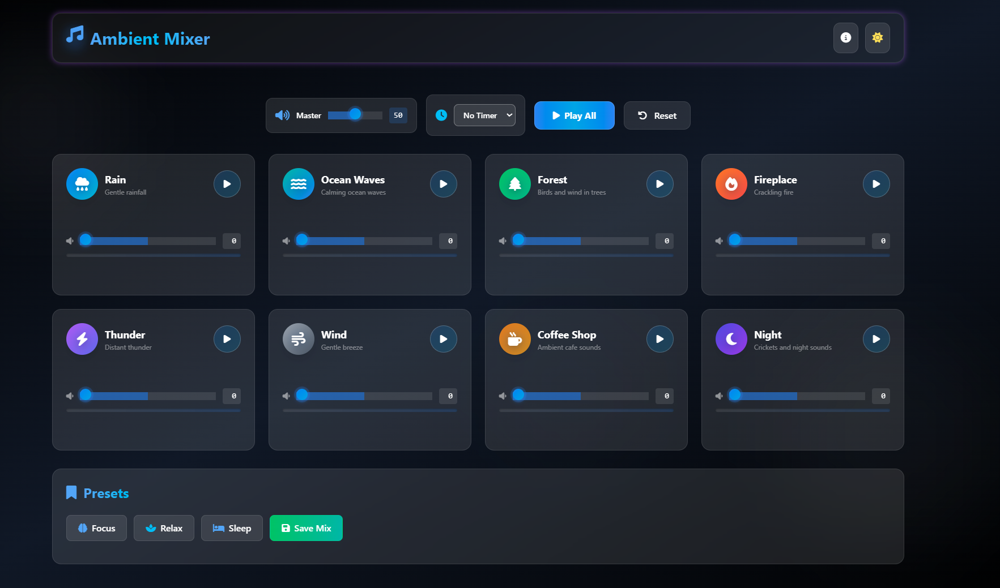

# 🎧 Ambient Mixer

A modern and relaxing web app that lets users mix different ambient sounds — such as rain, ocean waves, forest, and fireplace — to create their own calming atmosphere. Perfect for focus, relaxation, or sleep.
---

## 🌟 Features

- 🎶 **Custom Sound Mixing** – Combine multiple ambient sounds like rain, thunder, coffee shop, or ocean waves.  
- 🔊 **Volume Controls** – Individual sliders for each sound element.  
- ⏱️ **Timer Support** – Set a timer for automatic stop.  
- 💾 **Save Mixes** – Store your favorite combinations for future use.  
- 🌙 **Dark Mode UI** – Elegant and soothing interface for nighttime use.  
- 🧠 **Presets** – Quick access to ready-made mixes for **Focus**, **Relax**, and **Sleep** modes.

---

## 🧰 Tech Stack

- **Frontend:** HTML, CSS, JavaScript  
- **Audio Control:** Web Audio API  
- **Design:** Modern dark-themed UI with glowing effects  

---

## 🚀 How It Works

1. Choose your favorite ambient sounds (Rain, Forest, Wind, etc.).  
2. Adjust individual volumes using the sliders.  
3. Click **Play All** to start your custom soundscape.  
4. Save your mix or use one of the built-in presets.

---

## 💡 Future Enhancements

- 🎚️ Custom sound uploads  
- ☁️ Cloud sync for saved mixes  
- 📱 Mobile-friendly version  
- 🔔 Alarm or reminder integration  

---

## 📸 Screenshot

---

## 🧑‍💻 Author

**Taz**  
A passionate developer exploring creative and relaxing web experiences.

---

## 🪄 License

This project is licensed under the **MIT License** — feel free to modify and share.
